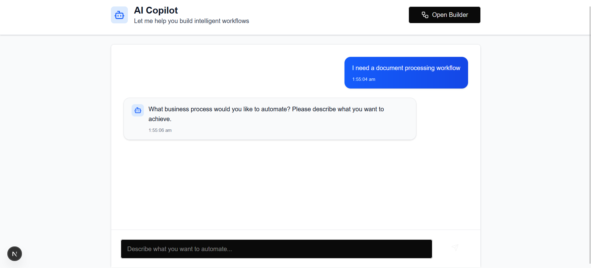
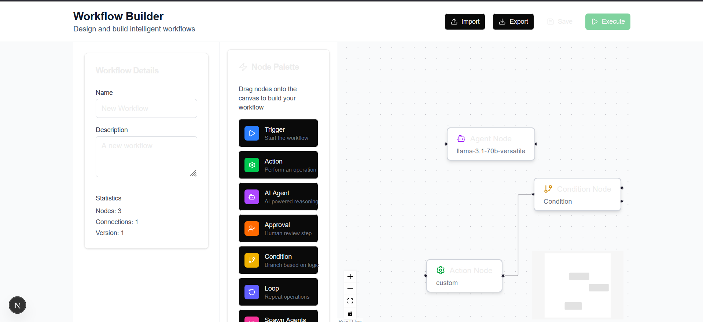

# Agentic Orchestration Builder

> *"Building systems is easy, but building simple systems that actually work is the hardest problem in engineering."*  
> — Inspired by Johan Cruyff's wisdom: "Playing football is simple, but playing simple football is the hardest thing there is."

---

## 🧠 The Thinking

Modern automation exists in two worlds that rarely talk to each other: deterministic workflows with predictable paths, and agentic systems with adaptive, context-driven decisions. This platform bridges that gap.

The core insight: **events should be the control plane**. Whether you're running a rigid approval chain or coordinating multiple AI agents making dynamic decisions, everything flows through durable, observable events. This means workflows can be deterministic when needed, agentic when required, and hybrid when real business demands it—all with full replay, human checkpoints, and cost tracking.

We treat AI agents not as black boxes, but as orchestrated participants in stateful workflows. Human judgment sits alongside machine reasoning, and both are first-class citizens with the same durability guarantees.

---

## 🏗️ Architecture Approach

**Event-Driven + Durable State = Reliable Agentic Systems**

The architecture rests on three pillars:

1. **Event-Driven Backbone**: Kafka-style message queues decouple services. Triggers, state changes, agent decisions, and approvals all flow as events. This enables replay, audit trails, and distributed coordination.

2. **Durable Workflow Engine**: Built on patterns from Temporal/Zeebe—every execution is persisted with timers, retries, compensations, and saga support. When an agent makes a decision or a human approves, that state is durable and recoverable.

3. **Multi-Agent Orchestration Layer**: Native support for coordinator, hierarchical, concurrent, and iterative refinement patterns. Agents get tool access, budget limits, policy checks, and can hand off to humans at critical steps—all without breaking execution flow.

The visual builder and AI copilot sit on top, but underneath it's a production-grade, event-sourced, multi-tenant system designed for horizontal scale, observability, and governance.

---

## 📂 Documentation

This repository contains detailed documentation organized as follows:

- **`/user-stories/`** — Use cases, feature scenarios, and video demonstration of user journeys through the platform
- [User Stories](https://drive.google.com/file/d/1_9eyj5hiqSoaVjqCyp1NnSvGwGp4MJWv/view?usp=sharing)

- **`/system-design/`** — Comprehensive architecture document and video walkthrough explaining the design decisions, trade-offs, and technical depth
- [System Design](https://drive.google.com/file/d/1P10MDk8M_g8ftKN_gAvHCW4sPwhxsUCB/view?usp=sharing)

Each folder contains both a pdf document and a video where I explain the thinking behind the design.

---

**Building systems that embrace complexity while pursuing simplicity.**

## AI Copilot 

